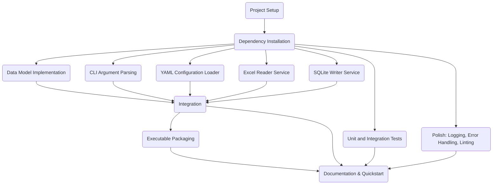

# Tasks: Excel to SQLite CLI Application

## Feature: Excel to SQLite CLI Application

---

## Status Summary

- [x] T001. Project Setup
- [x] T002. Dependency Installation
- [x] T003. Data Model Implementation [P]
- [x] T004. CLI Argument Parsing [P]
- [x] T005. YAML Configuration Loader [P]
- [x] T006. Excel Reader Service [P]
- [x] T007. SQLite Writer Service [P]
- [x] T008. Integration: Excel to SQLite Workflow
- [x] T010. Unit and Integration Tests [P]
- [ ] T009. Stand-alone Executable Packaging
- [ ] T011. Documentation and Quickstart Guide
- [ ] T012. Polish: Logging, Error Handling, Linting [P]

---

### T001. Project Setup

- Initialize Python project structure in `excel2sqlite_cli/`
- Create `pyproject.toml` or `setup.cfg` for packaging
- Add `.gitignore` for Python, build, and Windows artifacts

---

### T002. Dependency Installation

- Add dependencies to project:
  - `openpyxl` (latest)
  - `PyYAML`
  - `sqlite3` (standard library)
  - `argparse` (standard library)
  - `jsonschema`
- Ensure compatibility with Python 3.11.x, 3.12.x, 3.13.x

---

### T003. Data Model Implementation [P]

- Implement data models for:
  - Worksheet configuration (name, start row, start column)
  - Table schema representation
- File: `excel2sqlite_cli/models.py`

---

### T004. CLI Argument Parsing [P]

- Implement CLI using `argparse`:
  - Accept Excel file path, YAML config path, output SQLite file path
- File: `excel2sqlite_cli/cli.py`

---

### T005. YAML Configuration Loader [P]

- Implement loader for YAML config file
  - Validate structure and required fields
- File: `excel2sqlite_cli/config.py`

---

### T006. Excel Reader Service [P]

- Implement Excel reading logic using `openpyxl`
  - Support Japanese characters
  - Extract worksheet data from specified start row/column
- File: `excel2sqlite_cli/excel_reader.py`

---

### T007. SQLite Writer Service [P]

- Implement SQLite table creation and data insertion
  - Preserve Japanese characters in table/column/data
- File: `excel2sqlite_cli/sqlite_writer.py`

---

### T008. Integration: Excel to SQLite Workflow

- Integrate CLI, config loader, Excel reader, and SQLite writer
- Implement main workflow in `excel2sqlite_cli/main.py`

---

### T009. Stand-alone Executable Packaging

- Package project as a Windows stand-alone executable using `PyInstaller`
  - Ensure no need for Python or Excel installation on target machine
- File: `build/` artifacts

---

### T010. Unit and Integration Tests [P]

- Write unit tests for:
  - Data models
  - Config loader
  - Excel reader
  - SQLite writer
- Write integration tests for end-to-end workflow
- File: `tests/`

---

### T011. Documentation and Quickstart Guide

- Write usage documentation and quickstart guide
  - Include example YAML config and Excel file
- File: `README.md`, `specs/quickstart.md`

---

### T012. Polish: Logging, Error Handling, Linting [P]

- Add logging for workflow steps and errors
- Implement robust error handling for file I/O, config, Excel, and SQLite operations
- Apply linting and code formatting (`ruff`, `black`)

---

## Parallel Execution Guidance

- Tasks marked [P] can be executed in parallel:
  - T003, T004, T005, T006, T007, T010, T012
- Example parallel execution command:
  - `task-agent run T003 T004 T005 T006 T007 T010 T012`

- Sequential tasks (must follow setup and integration order):
  - T001 → T002 → [P tasks] → T008 → T009 → T011

---

## Dependency Notes

- **T001 (Project Setup)** and **T002 (Dependency Installation)** must be completed before any parallel tasks.
- Parallel tasks (**T003**, **T004**, **T005**, **T006**, **T007**, **T010**, **T012**) can be executed after setup and dependencies.
- **T008 (Integration)** depends on completion of all core modules (T003–T007).
- **T009 (Packaging)** depends on a working main workflow (T008).
- **T011 (Documentation)** follows implementation and packaging.

---

## Task Dependency Visualization

